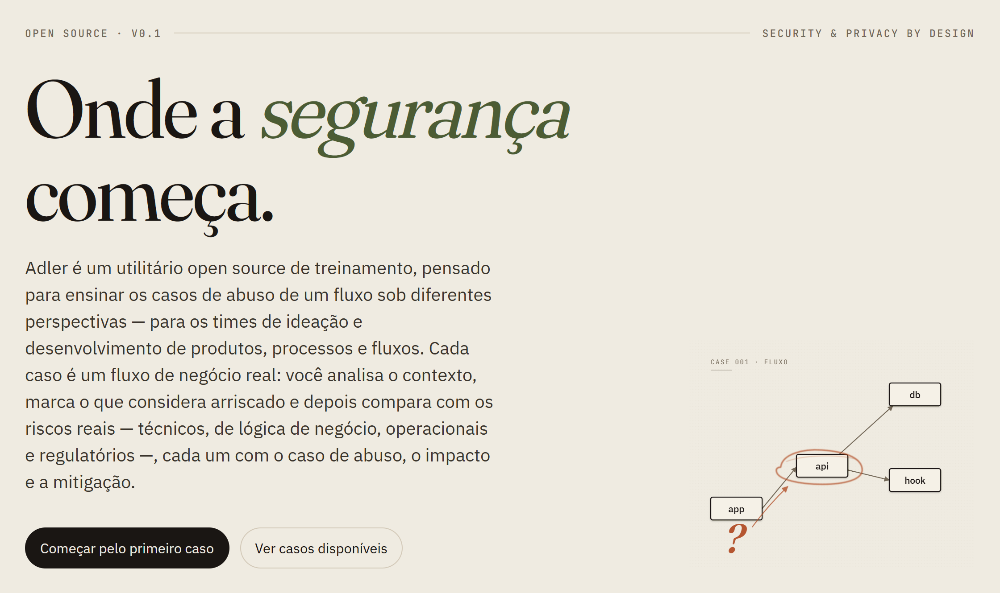
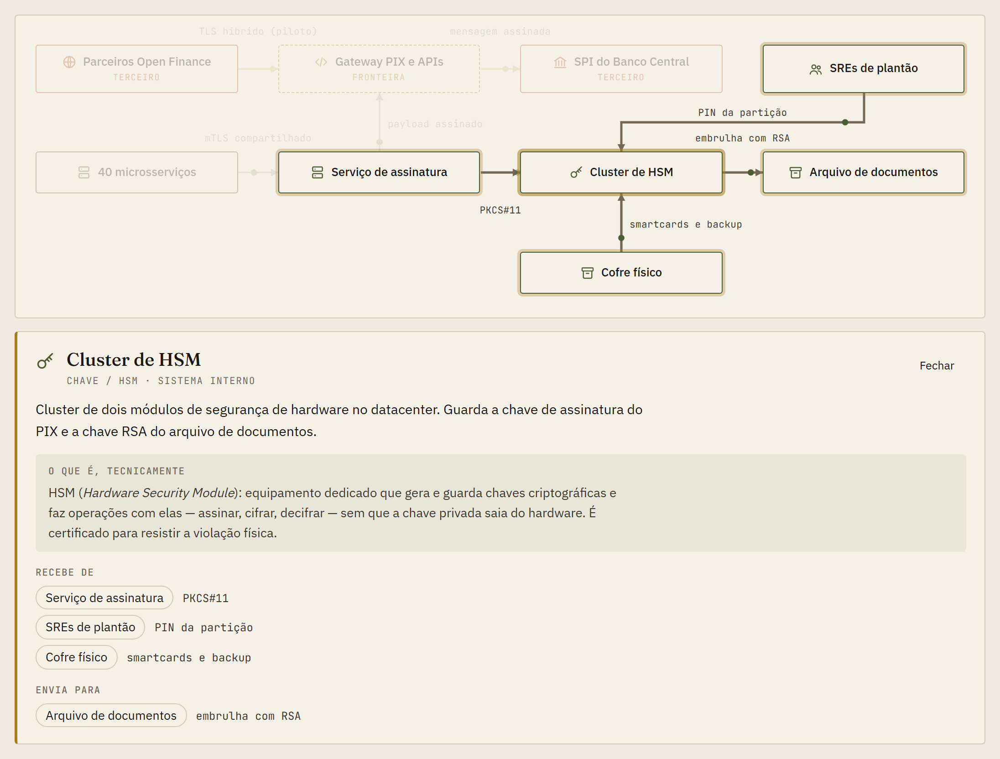
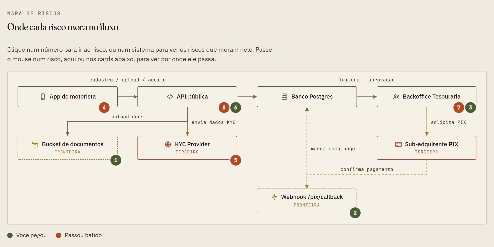

<div align="center">

<a href="https://2t0nnks.github.io/baker-street/">
  <picture>
    <source media="(prefers-color-scheme: dark)" srcset="docs/img/hero-dark.png">
    
  </picture>
</a>

### [▶&nbsp; Jogar agora](https://2t0nnks.github.io/baker-street/)

</div>

> O motorista sobe **o mesmo canhoto** em duas antecipações.
> O convidado faz o PIX qualificador **para quem o indicou**.
> **Doze SREs** sabem o PIN do HSM que assina o PIX.
>
> Nenhum scanner pega isso. Quem pega é quem leu o fluxo antes do primeiro commit.

**Adler** treina essa leitura. Você estuda um fluxo de negócio real, marca o que acha arriscado e vê os casos de abuso — com impacto e mitigação. Para produto, engenharia, segurança, tesouraria, antifraude e compliance.

## Casos

| | | |
|---|---|---|
| **[Frete Adiantado](https://2t0nnks.github.io/baker-street/?caso=frete-adiantado)** | fintech | antecipação de recebíveis para caminhoneiros |
| **[Indique e Ganhe](https://2t0nnks.github.io/baker-street/?caso=indique-e-ganhe)** | fintech | campanha de indicação com bônus via PIX |
| **[Link de Pagamento](https://2t0nnks.github.io/baker-street/?caso=link-de-pagamento)** | fintech | subcredenciadora com repasse em D+2 |
| **[Saque Antecipado](https://2t0nnks.github.io/baker-street/?caso=saque-antecipado)** | fintech | antecipação do FGTS por correspondentes |
| **[Cofre de Chaves](https://2t0nnks.github.io/baker-street/?caso=cofre-de-chaves)** | fintech | HSM do PIX e transição pós-quântica |
| **[Consulta Expressa](https://2t0nnks.github.io/baker-street/?caso=consulta-expressa)** | saúde | telemedicina com receita e atestado |

## Como é

Contexto → fluxo → leitura → revelação → placar. Clique em qualquer sistema para ver o que ele é e com quem troca dados.

<picture>
  <source media="(prefers-color-scheme: dark)" srcset="docs/img/fluxo-dark.png">
  
</picture>

Na revelação, cada risco aparece onde mora no fluxo — verde se você pegou, vermelho se passou batido. Marcar tudo não compensa: armadilha desconta.

<picture>
  <source media="(prefers-color-scheme: dark)" srcset="docs/img/mapa-dark.png">
  
</picture>

## Escreva um caso

Um caso é um JSON em `cases/`. O resto o motor faz.

```bash
npm install && npm run new    # exemplo completo em cases/<slug>.json
npm run validate              # tudo o que o motor precisa para desenhar
npm run dev                   # localhost:8000/?caso=<slug>&debug=layout
```

[Passo a passo](./docs/CONTRIBUTING.md) · [O que faz um caso bom](./docs/CASE_GUIDELINES.md) · [Campos](./docs/SCHEMA.md) · [Segurança](./SECURITY.md)

---

<div align="center">
<sub>Código <a href="./LICENSE">MIT</a> · casos <a href="./LICENSE-CASES">CC BY-SA 4.0</a> · sem analytics, sem terceiros<br>
Homenagem a Irene Adler, que leu Sherlock Holmes antes que ele a lesse.</sub>
</div>
