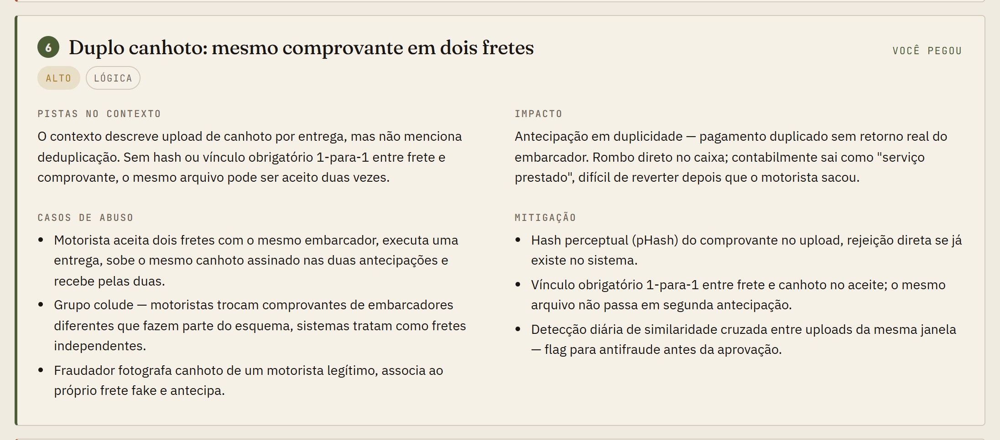
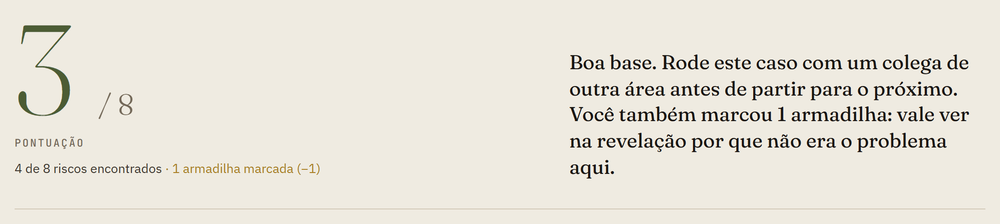

<div align="center">

<a href="https://2t0nnks.github.io/baker-street/">
  <picture>
    <source media="(prefers-color-scheme: dark)" srcset="docs/img/hero-dark.png">
    
  </picture>
</a>

<br>

[](https://github.com/2T0nnks/baker-street/actions/workflows/deploy.yml)
[](https://github.com/2T0nnks/baker-street/actions/workflows/validate.yml)
[](./LICENSE)
[](./LICENSE-CASES)

### [▶&nbsp; Jogar agora](https://2t0nnks.github.io/baker-street/)

</div>

---

> O motorista sobe **o mesmo canhoto** em duas antecipações e recebe duas vezes.
> O convidado faz o PIX qualificador **para quem o indicou**, e os dois ficam com o bônus.
> **Doze SREs** sabem o PIN da partição do HSM que assina as mensagens PIX do banco.
>
> Nenhum scanner pega isso. Quem pega é alguém que leu o fluxo procurando casos de abuso — antes do primeiro commit.

O **Adler** treina essa leitura. Cada caso é um fluxo de negócio realista: você estuda o contexto e o diagrama, marca o que acha arriscado e só então vê os riscos reais — com as pistas que estavam no texto, os casos de abuso, o impacto e a mitigação.

É feito para os times que desenham e constroem produtos, processos e fluxos: produto, engenharia, segurança, tesouraria, antifraude, compliance. Roda no navegador, sem cadastro, e não faz nenhuma requisição a terceiros.

## Os casos

| | Caso | Um dos casos de abuso que ele esconde |
|---|---|---|
| fintech | **[Frete Adiantado](https://2t0nnks.github.io/baker-street/?caso=frete-adiantado)** <br><sub>Antecipação de recebíveis para caminhoneiros · Intermediário</sub> | o mesmo canhoto aceito em dois fretes |
| fintech | **[Indique e Ganhe](https://2t0nnks.github.io/baker-street/?caso=indique-e-ganhe)** <br><sub>Campanha de indicação com bônus e saque via PIX · Intermediário</sub> | o PIX qualificador feito para o próprio indicador |
| fintech | **[Link de Pagamento](https://2t0nnks.github.io/baker-street/?caso=link-de-pagamento)** <br><sub>Subcredenciadora com repasse em D+2 · Intermediário</sub> | o lojista paga os próprios links com cartões roubados |
| fintech | **[Saque Antecipado](https://2t0nnks.github.io/baker-street/?caso=saque-antecipado)** <br><sub>Antecipação do FGTS por correspondentes bancários · Avançado</sub> | a selfie "para a consulta" que vira contrato |
| fintech | **[Cofre de Chaves](https://2t0nnks.github.io/baker-street/?caso=cofre-de-chaves)** <br><sub>HSM do PIX e um plano pós-quântico às pressas · Avançado</sub> | o serviço que assina qualquer coisa para qualquer um |
| saúde | **[Consulta Expressa](https://2t0nnks.github.io/baker-street/?caso=consulta-expressa)** <br><sub>Telemedicina com receita, atestado e farmácias · Intermediário</sub> | a conta entregue a quem sabe CPF e data de nascimento |

<sub>Em breve: <b>Tutor com IA na sala de aula</b> (edtech) · <b>Fila de Especialidades</b> (saúde pública).</sub>

Cada caso tem 8 riscos reais espalhados por categorias — técnico, lógica de negócio, operativo, processo, regulatório, privacidade, fraude — e quatro armadilhas: preocupações legítimas que não são o problema *daquele* fluxo. Saber descartá-las faz parte do treino.

## Por dentro de um caso

**1 · Contexto → 2 · Fluxo.** A empresa, o time, os terceiros e os números; depois, o diagrama se monta na ordem em que os dados passam. Clique em qualquer sistema para ver o que ele faz no caso, **o que ele é tecnicamente** e com quem troca dados.

<picture>
  <source media="(prefers-color-scheme: dark)" srcset="docs/img/fluxo-dark.png">
  
</picture>

**3 · Leitura → 4 · Revelação.** Você marca o que suspeita, sem gabarito. Na revelação, o **mapa de riscos** mostra no próprio fluxo onde cada risco mora — verde para o que você pegou, vermelho para o que passou batido.

<picture>
  <source media="(prefers-color-scheme: dark)" srcset="docs/img/mapa-dark.png">
  
</picture>

Cada risco vem com as pistas que estavam no contexto, os casos de abuso escritos como o adversário faria, o impacto e mitigações que dá para implementar no sprint seguinte.

<picture>
  <source media="(prefers-color-scheme: dark)" srcset="docs/img/risco-dark.png">
  
</picture>

**5 · Placar.** Acerto soma, armadilha desconta — marcar tudo não compensa. Fecha com os padrões que valem para o próximo fluxo.

<picture>
  <source media="(prefers-color-scheme: dark)" srcset="docs/img/placar-dark.png">
  
</picture>

## Numa sessão de treinamento

Um caso por sessão, de 60 a 90 minutos:

| Tempo | O que fazer |
|---|---|
| **10 min** | Cada pessoa lê o contexto e explora o fluxo sozinha, clicando nos sistemas. |
| **15 min** | Leitura individual e em silêncio: cada um marca os riscos que enxerga. |
| **30–45 min** | Revelação em grupo. Para cada risco: quem pegou, quem não pegou, e por quê. |
| **10 min** | Placar e padrões: o que desse caso aparece nos fluxos do próprio time? |

O melhor material é a divergência: a tesouraria vê o que a engenharia não vê, e o antifraude vê o que o produto não vê. É esse ponto cego entre áreas que o Adler expõe.

## Escreva um caso

Um caso é um arquivo JSON em `cases/`. O motor não tem nenhuma linha específica de caso: o fluxo animado, o painel dos sistemas, o mapa de riscos e o placar saem todos dos dados.

```bash
npm install
npm run new          # cria cases/<slug>.json com um exemplo pequeno, completo e válido
npm run validate     # schema + tudo o que o motor precisa para desenhar o caso
npm run dev          # http://localhost:8000/?caso=<slug>&debug=layout
```

O `debug=layout` mostra, embaixo de cada diagrama, se algum rótulo, pino ou seta ficou em cima de outra coisa. Verde, abre o pull request: o CI valida sozinho e a revisão editorial olha realismo, armadilhas e mitigações.

→ [Passo a passo](./docs/CONTRIBUTING.md) · [O que faz um caso bom](./docs/CASE_GUIDELINES.md) · [Todos os campos](./docs/SCHEMA.md)

Quem tem um caso aprovado entra como **Irregular** — os garotos de rua que faziam o reconhecimento de campo para Sherlock Holmes em Londres.

## Por baixo

```
cases/     um JSON por caso                       CC BY-SA 4.0
engine/    o motor: um HTML com CSS e JS           MIT
schema/    JSON Schema dos casos
scripts/   build, validação, gerador de casos, servidor local
docs/      guias de contribuição, de escrita e do schema
```

O build injeta os casos no motor e gera um site estático, publicado no GitHub Pages a cada merge no `main`. Sem analytics, sem fontes ou scripts de terceiros, com Content-Security-Policy que só libera o script do motor, e com o conteúdo dos casos validado para não carregar marcação perigosa. O progresso fica só no seu navegador.

Achou uma vulnerabilidade? Não abra issue pública — veja o [SECURITY.md](./SECURITY.md).

## Licenças

Código (`engine/`, `scripts/`) sob [MIT](./LICENSE). Casos e documentação (`cases/`, `docs/`) sob [CC BY-SA 4.0](./LICENSE-CASES).

---

<div align="center">

<sub><b>Adler</b> é uma homenagem a Irene Adler, a única a superar Sherlock Holmes — porque o leu antes que ele a lesse.<br>O repositório se chama <code>baker-street</code>.</sub>

</div>
